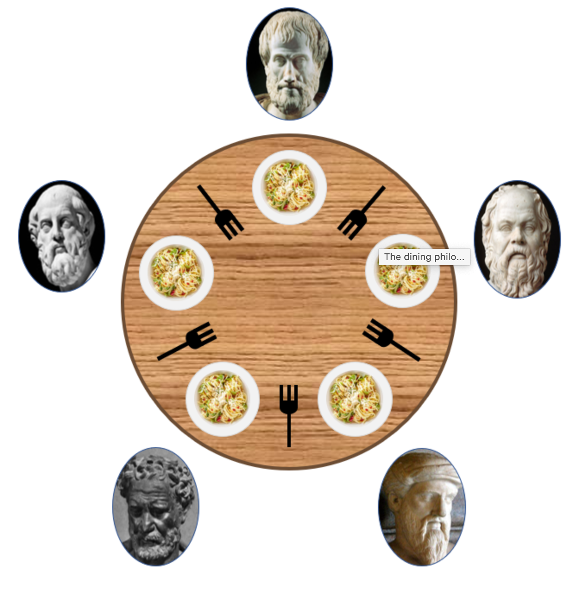

# philosophers

-   생각하고, 잠자고, 먹는 철학자들이 한 테이블에 앉아있다. 테이블에는 스파게티가 있고, 철학자들은 그 스파게티를 먹기위해서는 두개의 포크가 필요하다. 하지만 포크는 철학자들에게 단 하나씩만 배정되어있다.
-   이 때, 포크는 공유자원이 되고 철학자들은 각각 하나의 스레드로 여겨진다. 모두가 포크를 하나씩 들고있다면 어느 철학자도 두개의 포크를 쥘 수 없고, 모두가 스파게티를 먹을 수 없을것이다. 이를 교착상태(Deadlock)라고 한다
-   각각의 포크들은 뮤택스로 보호받아야한다. 이는 여러 철학자가 한 포크에 동시에 달려들어 조정하는것을 막아준다.
    -   이는 여러 cpu가 스레드가 동시에 실행하는것 처럼 보이지만 사실은 컨텍스트 스위칭을 일으키며 각각의 스레드를 진행시키고 있기 때문에, 뮤택스로 보호받니 않은 공유자원은 예상하지 못한 결과를 배출하기 때문이다.
-   데드락을 해결하기 위해서는 여러가지 방법이 있지만, 나는 짝수번째 철학자가 먼저 포크를 쥐고 밥을 먹은 후 내려놓고 홀수번째 철학자들이 양 옆의 포크를 쥐어 모든 철학자들이 밥을 먹는 방법을 선택했다.

## args

1. `number_of_philosophers`

    철학자 수(+ 포크의 수)

2. `time_to_die`

    지난 번 식사로부터 식사를 마칠 때까지 남은 시간.

3. `time_to_eat`

    밥 먹는 데 걸리는 시간. 두 개의 포크를 사용해야 한다.

4. `time_to_sleep`

    잠자는 데 걸리는 시간.

5. `number_of_times_each_philospher_must_eat`

    옵션이며, 식사 횟수가 이 변수의 값과 같아지면 프로그램 종료.

 
 
